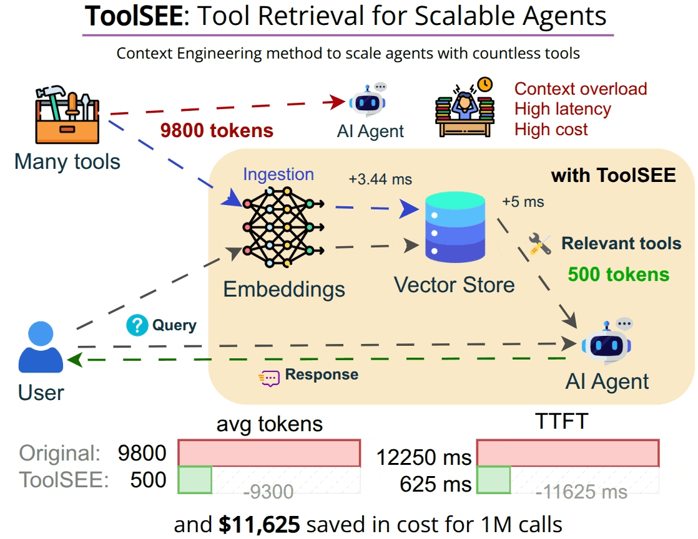
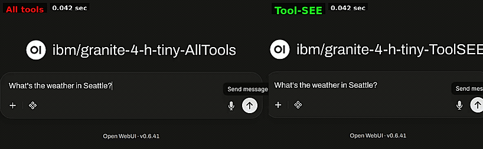

<!-- # ToolSEE: Tool Retrieval for Scalable Agents -->
<p align="center">

</p>

**Comparison of agent workflows with and without ToolSEE:**


<h4 align="center"><em>ToolSEE helps multi-tool agents stay fast, cheap, and accurate by selecting only the tools they need.</em></h4>

## Why this exists
Agents often get overloaded with large collections of tools and struggle to choose the right one. As tool catalogs grow (hundreds → thousands), agents get hit by a scalability bottleneck due to:
- **Higher latency & cost:** Larger context take longer and cost more. Organizations that use multi-tool agents don’t just pay for tool execution — they pay for including tools in the context.
- **Lower reliability:** Noisy tool-set increase wrong tool-calls and hallucinations which make model take more steps before final response.

## What ToolSEE does
ToolSEE is a lightweight tool retrieval layer that keeps the agent’s context small while still letting it use large tool catalogs.
ToolSEE stands for Tool Search Engine for Efficient Agents. ToolSEE indexes your tools (name/description + metadata), then retrieves and ranks the most relevant tools for the current user request.

**Outcome:** the model sees a small, high-signal tool-set instead of a giant, noisy catalog.

__Key features__:
- Real-time search and ranking of tools relevant to the current task.
- Filters tools by relevance (and supports score thresholds).
- Allows the agent to **search** for more tools mid-run via a `search_tools` tool.

## Why it matters
Selecting the right tool at the right moment is the difference between a reliable agent and a hallucination-prone one. ToolSEE keeps context usage effectively constant (`O(1)`) irrespective of the number of available tools, as the model only receives a list of the few selected tools.

ToolSEE makes large tool catalogs usable in production:
- **Less noise → fewer wrong tools:** Retrieval narrows the action space.
- **Less context → lower latency & cost:** Fewer tokens sent per call.
- **Better scalability:** Add tools without “prompt bloat”.

## How it works
- Ingests tools into `ToolMemory` (in-memory store of embeddings + metadata).
- Retrieves top "k" tools by cosine similarity for the current query.
- Attaches only the selected tools to the agent and let the agent call `search_tools` tool using its own query to fetch more tools.

## Quick Start

### 1) Install

```bash
pip install -e .
```

### 2) Configure environment variables

ToolSEE uses OpenAI-compatible chat + embeddings through LangChain/OpenAI.

Create a `.env` in the repo root (or export env vars) using `.env.example` as a template.

### 3) Run the end-to-end demo

```bash
python examples/test_flow.py
```

This script:
- creates a small demo tool set,
- ingests it into `ToolMemory`,
- runs retrieval with `select_tools_for_query`,
- and runs the example agent loop with dynamic tool expansion.


## Use it in your agent

At minimum, you need two steps: ingest tools, then retrieve on each user query.

```python
from tool_see import ToolMemory, select_tools_for_query

tool_memory = ToolMemory()

tools = [
	(
		"file_search",
		{
			"name": "file_search",
			"description": "Search project files by pattern.",
			"function": lambda query: f"Searching for {query}",
		},
	),
	(
		"test_runner",
		{
			"name": "test_runner",
			"description": "Run unit tests.",
			"function": lambda: "Tests run successfully.",
		},
	),
]

tool_memory.add_tools(tools)  # Ingests new tools into the vector memory

query = "run tests and report failures"
selected = select_tools_for_query(query=query, top_k=5, tool_memory=tool_memory)

for t in selected:
	print(t["_tool_id"], t["_score"], t.get("description", ""))
```

If you want the agent to fetch *additional* tools at runtime, see the dynamic tool expansion pattern in `tool_see/auto_tool_agent.py` (`search_tools` + middleware).


## Evaluation

This repo includes scripts to reproduce selection accuracy, latency, and token savings using the MetaTool toolset/datasets.

Run:

```bash
pip install -e .[eval]
python -m benchmark_toolsee.benchmark
```

TTFT (requires `OPENAI_API_KEY` + `OPENAI_MODEL`):

```bash
python -m benchmark_toolsee.ttft_comparison
```

### Benchmark results

- Tool Selection Accuracy:
	- Multi-tool:
		- Tool Correctness score: 88.33%
		- Median Latency (ms): 8.82 ms
		- Median Token savings: 95%
		- Total queries: 497
	- Single-tool: 
		- Tool Correctness score: 81.0%
		- Median Latency (ms): 9.97 ms
		- Median Token savings: 96%
		- Total queries: 500 (random sample from 20,614 rows)
	- Total tokens for all tools: 9804

- TTFT evaluation:
	- Median TTFT with all tools: 6196.5 ms
	- Median TTFT with 5 tools: 436.0 ms
	- Difference in TTFT: 5760.5 ms
	<!-- 
	- Percentage reduction in TTFT: 92.96%
	- Total tokens for all tools: 4709
	- Total tokens for selected tools: 128
	- Token difference: 4581 tokens
	- Token savings: 97.28%
	- GPT input price is $1.25/1M tokens.
	- Input cost for all tools for 1000 calls: 4709 tokens * 1000 * $1.25 / 1,000,000
										4709 * 1000 * 1.25 / 1,000,000 = $5.88625
	- Input cost for selected tools for 1000 calls: 128 tokens * 1000 * $1.25 / 1,000,000
										128 * 1000 * 1.25 / 1,000,000 = $0.16 -->

Future versions of the project might score better.

> Note: Exact token→latency and token→cost depends on your provider/model and pricing.
> The benchmarks below show the *measured* selection latency and the *measured* token savings in this repo.